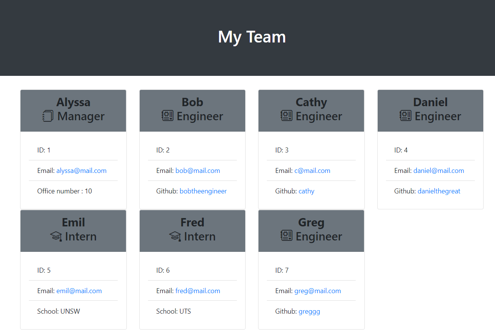

# Team Profile Generator

## Description

This is a Javascript application that takes in information about the members of a software engineering team then generates an HTML webpage that displays summaries for each person.

The application starts by asking the team manager’s name, employee ID, email address, and office number. After receiving valid values, the application presents a menu with the option to add an engineer or an intern or to finish building the team. If the user wants to add an Engineer, the application would ask for the engineer’s name, ID, email, and GitHub username, and the would show the options to add team members or finish building the team. If the user wants to add an Intern, it would ask for the intern’s name, ID, email, and school, and then would present the same menu. This would repeat until the user selects the option to finish building the team. If the user selects that, the application would then generate the HTML to present the team members as cards and their corresponding details are placed as the body of the cards created and it would exit the application. The emails and github profiles created would also be shown as links to either open the email application to send an email or open a new tab in the browser with the github profile.

This program is ran using Node.js with modules Inquirer and Filesystem that handles the questions and their corresponding answers, and the writing of the files respectively.

## Demonstration of Test and Generation of HTML file

The program is run in the command line, first running the test and then running the actual application where the user needs to add team member's details.

https://user-images.githubusercontent.com/99376802/166104551-bf78698f-d093-47ef-ada4-60f6cccf5eb1.mp4

### HTML sample file

The generated HTML file would look something like below:



## Installation

After forking the project, run the code below to install the modules needed to run this program:

```
npm install
```

## Usage

To run the program, run the code below:

```
npm start
```

## Test

To test the classes created for this program, run the code below:

```
npm run test
```
